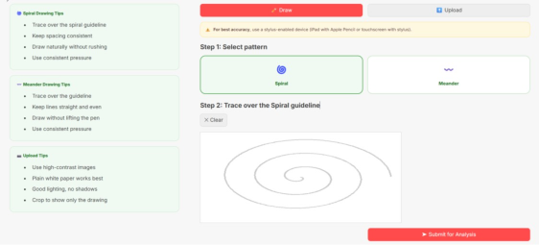
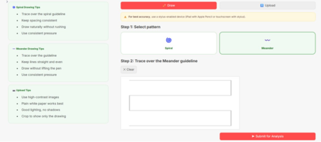
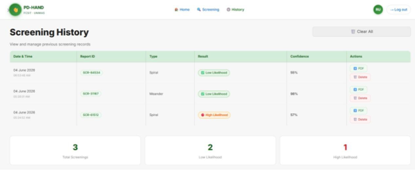
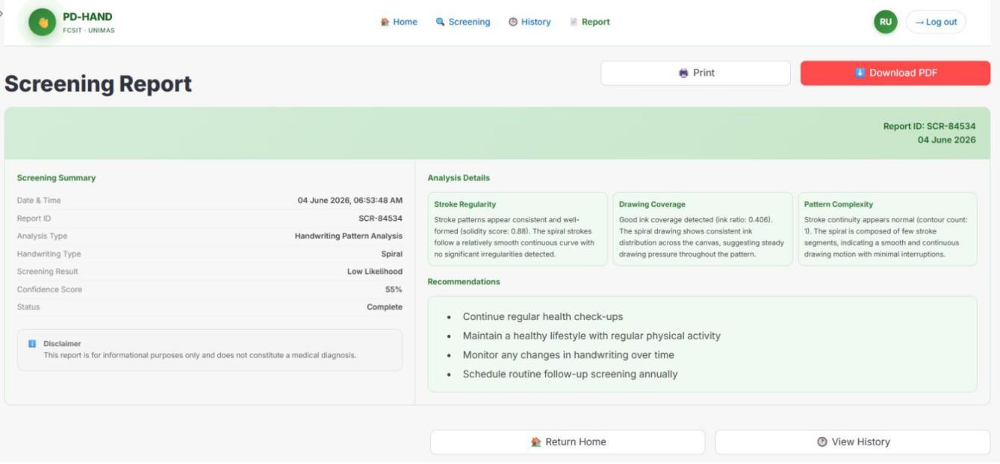
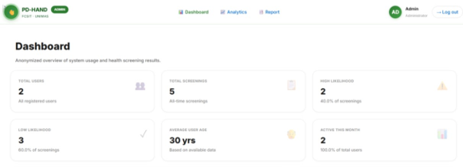

# PD-HAND

### AI-Based Web System for Early Detection of Parkinson's Disease from Handwriting

PD-HAND is a machine-learning-based web application developed to support the preliminary screening of Parkinson's disease through handwriting pattern analysis.

The system analyses **spiral** and **meander** handwriting patterns using image processing and machine learning techniques. Users can either draw directly on the application or upload/capture an image of a completed handwriting pattern.

> **Disclaimer:** PD-HAND was developed as an academic research project for screening, research, and educational purposes. It is not a medical diagnostic tool and does not replace assessment by a qualified healthcare professional.


---

## Overview

Changes in handwriting and fine motor control can be associated with Parkinson's disease. PD-HAND explores the use of machine learning and image processing as a non-invasive approach for analysing handwriting patterns during preliminary screening.

The system provides two main interfaces:

- **User Portal** — for handwriting screening, screening history, and report generation
- **Admin Portal** — for viewing anonymized screening statistics and system usage information

---

## Key Features

### User Portal

- User registration and authentication
- Password recovery and profile management
- Spiral and meander handwriting screening
- Direct drawing using a touchscreen or stylus-enabled device
- Image upload and camera capture
- Automated image preprocessing
- Handwriting feature extraction
- Machine-learning-based classification
- Likelihood-based screening results
- Screening history
- Automated screening report generation
- Downloadable PDF reports

### Admin Portal

- Administrator authentication
- Anonymized screening dashboard
- Aggregated screening statistics
- Screening outcome summaries
- Usage and demographic information
- Results reporting
- CSV and PDF export functionality

---

## System Demonstration

### Handwriting Drawing

Users can select either a spiral or meander pattern and trace the provided guideline directly within the application.



### Image Upload and Camera Capture

Users may also print the handwriting template and upload an image or capture a photograph of the completed drawing.



### Screening History

Previous screenings are stored in the user's screening history, allowing past results and generated reports to be reviewed.



### Screening Report

PD-HAND generates a screening report containing the screening result together with handwriting analysis information such as stroke regularity, drawing coverage, and pattern complexity.



### Administrator Portal

PD-HAND includes a separate administrator interface for accessing anonymized screening analytics.


The dashboard provides an overview of system usage and aggregated screening results without exposing personal user information.



---

## Machine Learning Workflow

```text
Handwriting Input
        │
        ▼
Image Preprocessing
        │
        ▼
Feature Extraction
        │
        ▼
Machine Learning Classification
        │
        ▼
Likelihood Prediction
        │
        ▼
Screening Result
        │
        ▼
Screening Report
```

---

## Image Preprocessing

Handwriting images are resized to **128 × 128 pixels** and converted to grayscale before further processing.

The preprocessing pipeline includes:

- Image resizing to 128 × 128 pixels
- Grayscale conversion
- CLAHE contrast enhancement
- Gaussian filtering
- Otsu binary thresholding

The preprocessing stage prepares handwriting samples for consistent feature extraction and machine learning classification.

---

## Feature Extraction

The system combines handcrafted handwriting descriptors with image-based feature extraction techniques.

A total of **541 features** are used to represent each processed handwriting sample.

These include:

- 12 geometric and statistical handwriting features
- Histogram of Oriented Gradients (**HOG**)
- 10-bin Local Binary Pattern (**LBP**) histogram
- 7 Hu Moments

The extracted features represent characteristics such as handwriting shape, stroke distribution, texture, contour properties, and local pattern information.

---

## Dataset Preparation

Model development used handwriting samples from:

- The publicly available **HandPD dataset**
- Camera-style variations generated from handwriting samples
- Additional handwriting samples collected during system evaluation

To reduce class imbalance, the majority class was undersampled without replacement before model training.

Dataset files are **not included in this repository** because of dataset redistribution considerations and participant privacy.

Personally identifiable participant information and local application databases are also excluded.

---

## Model Development

Three supervised machine learning algorithms were evaluated for both spiral and meander handwriting classification:

- Logistic Regression
- Support Vector Machine (**SVM**)
- Random Forest

The models were evaluated using:

- An **80/20 stratified train-test split**
- **5-fold stratified cross-validation**
- Accuracy
- Precision
- Recall
- F1 Score

Random Forest achieved the strongest overall performance for both handwriting patterns and was selected as the final classifier for deployment.

---

## Model Performance

### Spiral Handwriting Classification

| Model | Accuracy | Precision | Recall | F1 Score | CV F1 Mean | CV F1 Std |
|---|---:|---:|---:|---:|---:|---:|
| Logistic Regression | 89.55% | 88.97% | 90.21% | 89.58% | 88.91% | 1.53% |
| **Random Forest** | **96.17%** | **95.21%** | **97.20%** | **96.19%** | **95.41%** | **2.07%** |
| SVM | 94.43% | 95.68% | 93.01% | 94.33% | 92.15% | 1.51% |

### Meander Handwriting Classification

| Model | Accuracy | Precision | Recall | F1 Score | CV F1 Mean | CV F1 Std |
|---|---:|---:|---:|---:|---:|---:|
| Logistic Regression | 90.76% | 93.62% | 87.42% | 90.41% | 89.28% | 1.58% |
| **Random Forest** | **97.36%** | **99.31%** | **95.36%** | **97.30%** | **96.33%** | **1.13%** |
| SVM | 96.04% | 97.93% | 94.04% | 95.95% | 94.55% | 1.46% |

Random Forest was selected as the final model for both handwriting patterns because it demonstrated the strongest overall test-set and cross-validation performance.

> Performance values represent experimental results obtained during development and evaluation of the academic project. They should not be interpreted as clinical diagnostic performance.

---

## Technology Stack

### Programming and Web Application

- Python
- Streamlit

### Machine Learning and Image Processing

- scikit-learn
- OpenCV
- NumPy
- Pandas
- scikit-image
- Joblib

### Database

- SQLite

### AI-Assisted Reporting

- Google Gemini API

### Version Control

- Git
- GitHub

---

## Project Structure

```text
PD-HAND/
│
├── .streamlit/
│   └── config.toml
│
├── core/
│   ├── auth.py
│   ├── convert_dataset.py
│   ├── database.py
│   ├── features.py
│   ├── predict.py
│   ├── preprocess.py
│   ├── preview_conversion.py
│   ├── report_generator.py
│   └── validation.py
│
├── pages/
│   └── ...
│
├── models/
│   ├── spiral/
│   └── meander/
│
├── spiral/                 # Spiral model training/evaluation
├── meander/                # Meander model training/evaluation
│
├── assets/
│   └── screenshots/
│
├── app.py                  # User portal entry point
├── admin_landing.py        # Administrator portal entry point
├── create_test_admin.py    # Administrator account setup
├── requirements.txt
├── .gitignore
└── README.md
```

---

## Installation

### 1. Clone the repository

```bash
git clone https://github.com/rositauja/PD-HAND.git
cd PD-HAND
```

### 2. Create a virtual environment

```bash
python -m venv venv
```

Activate the environment on Windows:

```bash
venv\Scripts\activate
```

### 3. Install the required packages

```bash
pip install -r requirements.txt
```

### 4. Configure the Gemini API key

Create a `.env` file in the project directory:

```text
GEMINI_API_KEY=your_api_key_here
```

API keys and other credentials should not be committed to the repository.

---

## Running the Application

### User Portal

```bash
streamlit run app.py
```

### Admin Portal

Create an administrator account:

```bash
python create_test_admin.py
```

Then start the administrator portal:

```bash
streamlit run admin_landing.py
```

---

## Privacy and Ethical Considerations

PD-HAND was designed with user privacy in mind.

- Participant handwriting samples are not included in the public repository.
- Personally identifiable user information is excluded.
- Local application databases are excluded.
- Administrative analytics use anonymized and aggregated screening information.
- Screening results are intended for preliminary screening only and are not medical diagnoses.

---

## Academic Project

PD-HAND was developed as a **Final Year Project** for the:

**Bachelor of Software Engineering with Honours**  
Faculty of Computer Science and Information Technology  
Universiti Malaysia Sarawak (UNIMAS)  
2025–2026

---

## Author

**Rosita Anak Uja**

Bachelor of Software Engineering with Honours  
Universiti Malaysia Sarawak (UNIMAS)